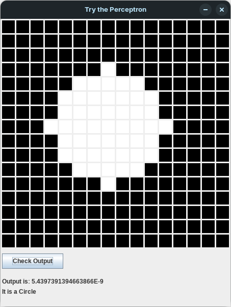
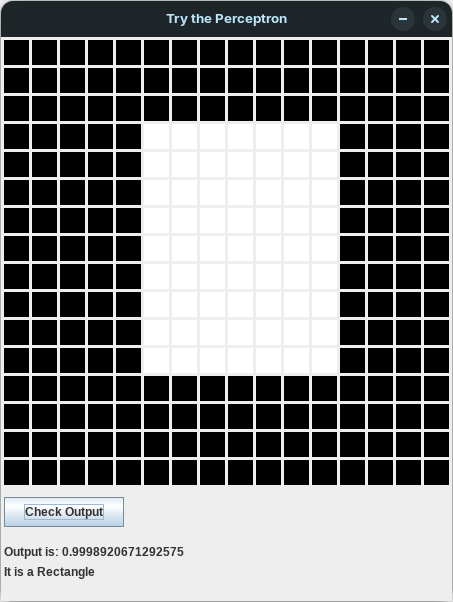

# Project Perceptron
An educational implementation of a single-layer-perceptron for binary classification between circles and rectangle on a 16 by 16 grid.

### Working
- `data-generator/dataGenerator.java` is used to generate the dataset in `dataset.txt`, which is moved to `perceptron/` directory.
- In the `perceptron/` directory, `perceptron.java`  uses `dataReader.java` to read the dataset from `dataset.txt`.
- An object of `neuron` class is created to perform **Forward Propagation** and **Back Propagation**.
- After training the perceptron for 2000 epochs, and testing it on a splitted section of the dataset, the weights and bias of the perceptron are written on `weights.txt` and `bias.txt`.
- `testPerceptron.java` reads the values of weights and bias from `weights.txt` and `bias.txt`, creates a GUI using Java Swing, and uses a 16 by 16 grid of buttons as a form of Input for the perceptron's weights and bias, it forward propagates the inputs and outputs its result when `Check Output` button is clicked. (Its accuracy is not as good as I anticipated.)

### Try it out

To be able to run this project on your own device, you'll need to have Java Compiler Installed beforehand.
1. Clone this Repository:
```bash
git clone https://github.com/IshaqJunejo/project-perceptron.git/
```

2. Navigate to the perceptron directory:
```bash
cd project-perceptron/perceptron/
```

3. Compile and Run `perceptron.java` if you want to train and test the perceptron.
4. Compile and Run `testPerceptron.java` if you want to test it on your own hand drawing.

### Screenshots





### Contributing

Despite being only a personal project, contributions are welcome!
1. Fork this repositry.
2. Create a branch.
3. Commit your changes.
4. Push to your branch.
5. Open a Pull Request.

### License

This project is licensed under the MIT License - see the [LICENSE](LICENSE) file for details.